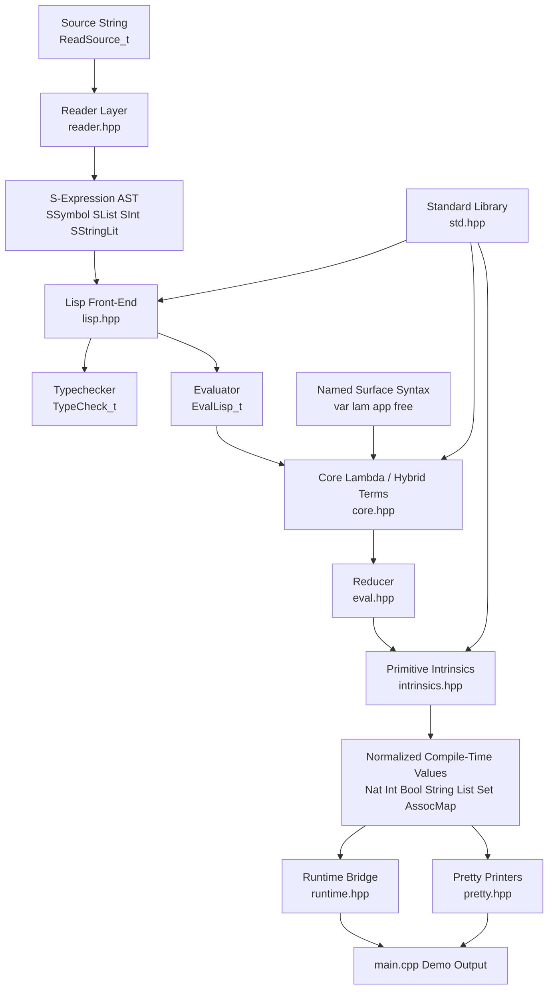

# Lambda Calculus Metaprogramming in C++

This repository is an experiment in treating the C++ type system as a computation engine.

At the center of the project is a small lambda-calculus evaluator built with templates. On top of that core, the library adds pragmatic intrinsic values, a typed Lisp-like front-end, a compile-time reader, pretty-printers, and a standard library of algorithms and data operations. The result is a header-only C++20 system that can reduce lambda terms, evaluate higher-level functional programs, and materialize useful results entirely at compile time.

## What Lambda Calculus Is

Lambda calculus is one of the simplest models of computation ever studied. It has only a few ideas:

- variables
- anonymous functions
- function application

In a tiny notation, the identity function is:

```text
λx. x
```

and applying it to `y` is:

```text
(λx. x) y
```

which reduces to:

```text
y
```

That reduction step is called beta reduction. In the pure lambda calculus, all computation is built out of repeatedly substituting arguments into function bodies. Numbers, booleans, conditionals, pairs, and lists can all be encoded with functions alone.

That idea matters because it reveals something deep: computation does not fundamentally require “machine instructions” in the everyday sense. It can emerge from a tiny symbolic rewriting system.

## Why Do This In C++ Templates

C++ templates are usually introduced as a generic programming feature, but they also form a compile-time symbolic engine:

- types can represent programs and values
- template instantiation can represent evaluation
- specialization can represent rewrite rules
- recursive aliases can represent reduction

This project explores that boundary deliberately. It asks:

- how far can we push C++ templates as a computational substrate?
- what happens if we build a small functional language inside the type system?
- where does pure lambda calculus become impractical, and what compromises are worth making?

The answer here is a hybrid design: keep substitution and application as the conceptual core, but introduce compact intrinsic value forms where pure Church encodings would be too expensive to use comfortably.

## Project Philosophy

This is not trying to be “pure” at all costs. It is trying to be intellectually honest, technically interesting, and actually usable.

The core ideas are:

- lambda substitution is still the heart of evaluation
- normal-order reduction still matters
- De Bruijn indexing keeps binding precise
- compact intrinsic values make nontrivial compile-time programs feasible
- a Lisp-like surface makes the system easier to interact with

So this is both:

- a lambda-calculus playground
- a serious metaprogramming experiment in abstract computation

## What The Library Contains

- A core lambda AST with `Var`, `Lambda`, `App`, `Call`, and `Free`
- Capture-avoiding shift and substitution
- Fuel-bounded normalization and optional checked normalization with cycle detection
- Intrinsic compile-time values:
  - `Nat<N>`
  - `Int<N>`
  - `Bool<B>`
  - `String<Chars...>`
  - `List<Ts...>`
  - `Set<Ts...>`
  - `AssocMap<Entries...>`
- Primitive reducers for arithmetic, comparisons, strings, lists, sets, and maps
- A typed Lisp-like AST with environments, closures, and typechecking
- A compile-time reader from source strings to Lisp AST
- Pretty-printers for values, types, lambda terms, Lisp forms, and errors
- A standard library with combinators and example algorithms
- Runtime bridge helpers so compile-time results can be printed from ordinary C++

## System Architecture



## Layer By Layer

### 1. Core lambda machinery

The lowest layer models terms directly:

- `Var<N>`
- `Lambda<Body>`
- `App<F, A>`
- `Call<Head, Args...>`
- `Free<Name>`

The evaluator canonicalizes applications into `Call<...>` spines, performs substitution safely, and reduces terms in a normal-order style.

This is the most “lambda calculus” part of the repository.

### 2. Hybrid intrinsic values

Pure lambda-calculus encodings are elegant, but in C++ templates they grow extremely fast. Church numerals, for example, are mathematically beautiful and mechanically punishing.

So this library introduces compact value forms:

- `Nat<5>` instead of a huge Church numeral
- `Int<-3>` for signed arithmetic
- `String<'o', 'k'>` for compile-time text
- `List<...>`, `Set<...>`, and `AssocMap<...>` for structured data

Primitive heads such as `Add`, `Mul`, `Range`, `Map`, `StringConcat`, `SetUnion`, and `MapFind` reduce directly when given intrinsic values.

This is the main optimization strategy of the project: still compute through symbolic reduction, but keep the data representation compact enough to survive real compile-time workloads.

### 3. Lisp-like front-end

Above the core sits a higher-level language layer in [include/lc/lisp.hpp](/home/ethan/dev/fun/metaprogramming/include/lc/lisp.hpp).

It introduces:

- `Ref<Name>`
- `LambdaExpr<Params<...>, Body>`
- `CallExpr<Fn, Args...>`
- `LetExpr<Bindings<...>, Body>`
- `IfExpr<Cond, Then, Else>`
- `BeginExpr<...>`
- `Closure<Params, Body, Env>`

This layer formalizes lexical environments and closures so programs can be written more like Lisp and less like raw De Bruijn terms.

### 4. Reader layer

The reader in [include/lc/reader.hpp](/home/ethan/dev/fun/metaprogramming/include/lc/reader.hpp) turns source strings into typed Lisp AST.

It currently supports:

- symbols
- integers
- booleans
- strings with escapes
- lists
- quote sugar
- line comments
- `if`
- `lambda`
- `let`
- `begin`
- primitive calls

That means we can now write source-level programs like:

```cpp
using Program = lc::ReadSource_t<
    "(let ((x 10) (make (lambda ((y Int)) (lambda ((z Int)) (+ (+ x y) z))))) ((make 5) 7))"
>;
```

instead of hand-assembling every AST node.

### 5. Pretty-printing and runtime bridge

Because type-level systems are hard to inspect, the library includes:

- `Pretty_t<T>`
- `pretty_string_view_v<T>`
- `to_int_v<T>`
- `to_bool_v<T>`
- `to_string_view_v<T>`
- `to_array_v<T>`
- `to_matrix_v<T>`

These make the compile-time world observable enough to debug and demo.

## Repository Layout

```text
lambda.hpp                Umbrella public header
include/lc/core.hpp       Core AST, utilities, named syntax, public aliases
include/lc/intrinsics.hpp Intrinsic values and primitive reductions
include/lc/eval.hpp       Shift, substitution, stepping, normalization
include/lc/lisp.hpp       Lisp AST, closures, environments, typechecking
include/lc/reader.hpp     Compile-time reader from strings to Lisp AST
include/lc/pretty.hpp     Pretty-printers for terms, values, types, and errors
include/lc/std.hpp        Standard library and example programs
include/lc/runtime.hpp    Runtime bridge for compile-time values
main.cpp                  Demo program
tests.cpp                 Static-assert based test suite
Makefile                  Clang-oriented build targets
```

## Standard Library Overview

The library surface is intentionally broad because the point is to explore what nontrivial compile-time computation feels like.

### Combinators

- `I`
- `K`
- `KI`
- `S`
- `B`
- `C`
- `W`
- `Y`

### Booleans and control

- `True`
- `False`
- `If`
- `Not`
- `And`
- `Or`

### Numbers

- `Nat<N>`
- `Int<N>`
- `Zero` through `Twelve`
- `NegOne` through `NegFive`
- `Succ`
- `Pred`
- `Add`
- `Sub`
- `Mul`
- `Div`
- `Mod`
- `Pow`
- `Eq`
- `Lt`
- `Lte`
- `Gt`
- `Gte`
- `IsZero`

### Strings

- `String<...>`
- `StringConcat`
- `StringLength`
- `StringEq`
- `StringContains`
- `StringStartsWith`
- `StringTake`
- `StringDrop`

### Lists

- `Nil`
- `Cons`
- `Head`
- `Tail`
- `IsEmpty`
- `Concat`
- `Reverse`
- `Length`
- `Range`
- `Map`
- `Filter`
- `Foldl`
- `Foldr`
- `Sum`
- `Product`
- `Any`
- `All`

### Sets

- `Set<...>`
- `SetInsert`
- `SetContains`
- `SetErase`
- `SetUnion`
- `SetIntersection`
- `SetSize`

### Maps

- `AssocMap<...>`
- `Entry<K, V>`
- `MapInsert`
- `MapFind`
- `MapContainsKey`
- `MapErase`
- `MapSize`

### Example algorithms

- `Sieve`
- `TwoSum`
- `MaxSubarraySum`
- `ThreeSum`
- `Factorial`

## Quick Examples

### Core lambda reduction

```cpp
#include "lambda.hpp"

using namespace lc;

static_assert(IsSame<Normalize_t<Apply_t<I, A>>, A>::value);
static_assert(IsSame<Normalize_t<Apply_t<S, K, K, A>>, A>::value);
```

### Intrinsic arithmetic

```cpp
#include "lambda.hpp"

using namespace lc;

static_assert(IsSame<Normalize_t<Apply_t<Add, Two, Three>>, Five>::value);
static_assert(IsSame<Normalize_t<Apply_t<Mul, Three, Four>>, Twelve>::value);
static_assert(IsSame<Normalize_t<Apply_t<Pow, Three, Two>>, Nine>::value);
```

### Functional list processing

```cpp
#include "lambda.hpp"

using namespace lc;

using Inc = Lambda<Apply_t<Succ, Var<0>>>;
using IsEven = Lambda<Apply_t<IsZero, Apply_t<Mod, Var<0>, Two>>>;

static_assert(IsSame<
    Normalize_t<Apply_t<Map, Inc, List<One, Two, Three>>>,
    List<Two, Three, Four>
>::value);

static_assert(IsSame<
    Normalize_t<Apply_t<Filter, IsEven, List<One, Two, Three, Four>>>,
    List<Two, Four>
>::value);
```

### Source-level reader example

```cpp
#include "lambda.hpp"

using namespace lc;

using Program = ReadSource_t<
    "(let ((x 10) (make (lambda ((y Int)) (lambda ((z Int)) (+ (+ x y) z))))) ((make 5) 7))"
>;

static_assert(IsSame<EvalLisp_t<Program>, Int<22>>::value);
static_assert(IsSame<TypeCheck_t<Program>, IntType>::value);
```

### Reader features

```cpp
#include "lambda.hpp"

using namespace lc;

using Untyped = ReadSource_t<"((lambda (x) x) 42)">;
using Quoted = ReadSourceEval_t<"'(1 2 3)">;
using WithComment = ReadSourceEval_t<R"(
  (begin
    ; comments are ignored
    ((lambda (msg) (string-append msg " reader")) "lambda"))
)">;

static_assert(IsSame<EvalLisp_t<Untyped>, Int<42>>::value);
static_assert(IsSame<Quoted, List<Int<1>, Int<2>, Int<3>>>::value);
```

### Classic algorithms at compile time

```cpp
#include "lambda.hpp"

using namespace lc;

static_assert(IsSame<
    Normalize_t<Apply_t<TwoSum, List<Two, Seven, Eleven, Nat<15>>, Nine>>,
    List<Nat<0>, Nat<1>>
>::value);

static_assert(IsSame<
    Normalize_t<Apply_t<MaxSubarraySum, List<NegTwo, Int<1>, NegThree, Int<4>, NegOne, Int<2>, Int<1>, NegFive, Int<4>>>>,
    Int<6>
>::value);
```

## Normalization Modes

### Fast default normalization

```cpp
using Result = Normalize_t<MyTerm, 1024>;
```

This is the default practical mode. It is fuel-bounded and optimized for getting useful work done.

If the evaluator runs out of steps, you get:

```cpp
OutOfFuel<Term>
```

### Checked normalization

```cpp
using Result = NormalizeChecked_t<MyTerm, 1024>;
```

This mode keeps track of previously seen terms and can detect exact syntactic cycles:

```cpp
static_assert(IsSame<NormalizeChecked_t<O, 16>, CycleDetected<O>>::value);
```

It is slower, but excellent for debugging nontermination.

## Demo Program

The demo in [main.cpp](/home/ethan/dev/fun/metaprogramming/main.cpp) shows that the library is not just evaluating toy combinators. It computes:

- a compile-time sieve of Eratosthenes
- two-sum
- maximum subarray sum
- three-sum
- string operations
- set and map operations
- closure-based Lisp programs
- reader-driven source programs
- pretty-printed parse errors

Typical output:

```text
primes up to 50: [2, 3, 5, 7, 11, 13, 17, 19, 23, 29, 31, 37, 41, 43, 47]
count: 15
sum: 328
two-sum indices for [2, 7, 11, 15], target 9: [0, 1]
maximum subarray sum for [-2, 1, -3, 4, -1, 2, 1, -5, 4]: 6
three-sum triplets for [-4, -1, -1, 0, 1, 2]: [[-1, -1, 2], [-1, 0, 1]]
string concat example: lambda calculus
set union of {1, 3, 5} and {3, 4, 5}: [1, 3, 5, 4]
lisp closure result: 22
reader parse error pretty: #<reader-error unterminated-list>
```

## Build And Run

This project is currently Clang-first and tuned for compile-time-heavy workloads.

Build the demo:

```bash
make demo
./bin/demo
```

Run the test suite:

```bash
make test
```

Generate Clang time traces:

```bash
make trace
```

The `trace` target enables `-ftime-trace`, which is helpful when you want to inspect template instantiation cost.

## Testing Strategy

The library is tested primarily with `static_assert` in [tests.cpp](/home/ethan/dev/fun/metaprogramming/tests.cpp). That matches the nature of the project: successful compilation is itself the proof that the compile-time computation succeeded.

The tests cover:

- lambda combinators
- substitution and shifting
- surface syntax compilation
- arithmetic and comparison primitives
- strings, lists, sets, and maps
- closure evaluation
- typechecking
- reader behavior
- parse errors
- fuel exhaustion and cycle detection
- larger example programs like sieve and interview-style algorithms

## Legacy Pure Encodings

The repository still keeps pure lambda-calculus encodings under `lc::church`.

That namespace is useful if you want to:

- compare the hybrid system against pure encodings
- study classic Church-style definitions
- experiment with the boundary between elegant theory and practical metaprogramming cost

## Tradeoffs

This project intentionally chooses a middle path.

What it keeps from pure lambda calculus:

- function application as a universal mechanism
- substitution-based reduction
- lexical binding discipline
- functional style as the dominant abstraction

What it bends for practicality:

- intrinsic numbers instead of default Church numerals
- intrinsic collections and strings
- primitive reducers
- typed front-end and reader layer

That compromise is the whole point. It lets the repository explore abstract computation without giving up the ability to run interesting programs at compile time.

## Where To Start Reading

If you want to understand the codebase from the inside out, a good reading order is:

1. [include/lc/core.hpp](/home/ethan/dev/fun/metaprogramming/include/lc/core.hpp)
2. [include/lc/eval.hpp](/home/ethan/dev/fun/metaprogramming/include/lc/eval.hpp)
3. [include/lc/intrinsics.hpp](/home/ethan/dev/fun/metaprogramming/include/lc/intrinsics.hpp)
4. [include/lc/lisp.hpp](/home/ethan/dev/fun/metaprogramming/include/lc/lisp.hpp)
5. [include/lc/reader.hpp](/home/ethan/dev/fun/metaprogramming/include/lc/reader.hpp)
6. [include/lc/std.hpp](/home/ethan/dev/fun/metaprogramming/include/lc/std.hpp)
7. [tests.cpp](/home/ethan/dev/fun/metaprogramming/tests.cpp)

If you want to understand it from the outside in, start with:

1. [main.cpp](/home/ethan/dev/fun/metaprogramming/main.cpp)
2. [include/lc/std.hpp](/home/ethan/dev/fun/metaprogramming/include/lc/std.hpp)
3. [README.md](/home/ethan/dev/fun/metaprogramming/README.md)

## Future Direction

The current library is already close to a tiny compile-time Lisp environment, but there is plenty of room to grow:

- more reader forms such as `define`, `cond`, and `list`
- a richer top-level environment
- type inference beyond explicit annotations
- macros or staged transforms
- more aggressive reduction optimizations
- better diagnostics for deeply nested compile-time failures

That makes this repository both a working system and an open-ended research playground.
